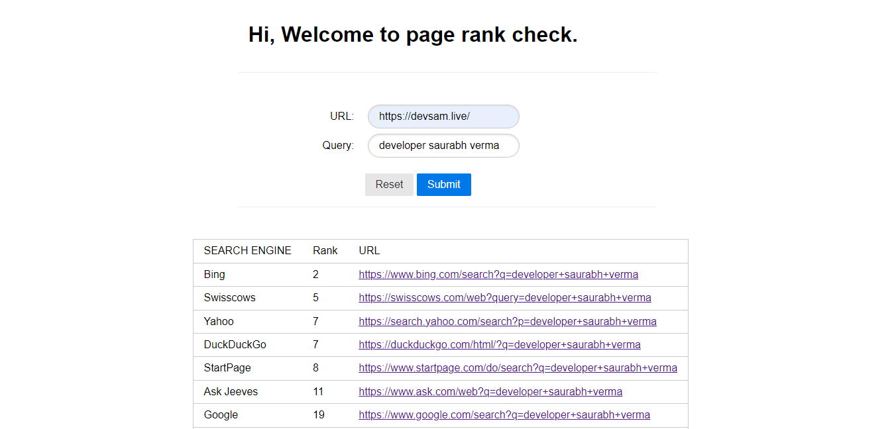

# Search Result Rank Checker

---

A Node.js utility function that gets the rank of a webpage in different search engines based on a search query.

## How to use it ?

### Requirements

An OS with `node.js` and `git` installed. If `git` is not installed you can downlad the code as a `zip` file, but still you need to have `node.js` installed

### Steps

1. clone the repo or download repo as zip

2. install dependencies by running `npm install`

3. start the server by running `npm start`

4. fill the `query` and `web-address` you want to check for

## How does it work?

you start with providing the `query` and `web-address` the the server on it's side starts a headless browser and query and look the webpage you provides.
For all search engines it looks for only the first search result page, except for `Google` where it looks for 5 search result pages. If the page is found it list the rank or the rank will be `999`

## Possible Reason if rank is always 999

The server looks for specific css selectors within search result page, which may change in future. I'll try my best to keep them updated.
